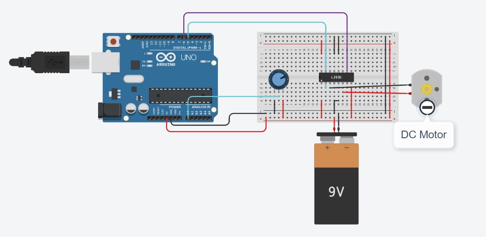

## electric forces and electrons Task🗣:<br />

## Description📄: <br />
**create a simple circuit powered by a DC motor,and write a simple algorithm that changes the speed of this motor.** <br />

## Circuit design :sparkles: :


## Hardware Required 🔨: 
○ Arduino Uno <br />
○ potentiometer<br />
○ H-bridge Motor Driver <br />
○ DC Mototr <br />
○ Breadboard <br />
○ 9V Battery <br />

## The Code 👨‍💻 :
```c++
int potIn;
int fwdPing = 5;
int revPin = 6;


void setup()
{
  pinMode(fwdPing , OUTPUT);
  pinMode(revPin, OUTPUT);
  
}

void loop()
{
  potIn = analogRead(A0);
  int output = potIn /4;
  analogWrite(revPin,output);
  delay(100);
}

```
<br />

## The simulation : <br /> 

#
https://user-images.githubusercontent.com/106310608/182031203-7d38562e-c2f3-4b5b-a3a4-029001daf598.mp4


